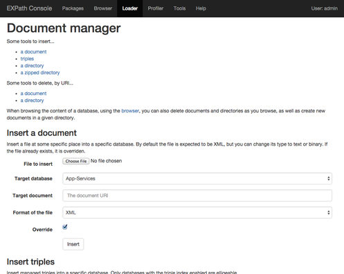
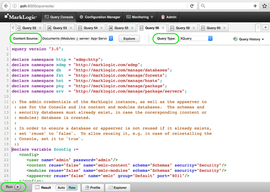

# EXPath Console for MarkLogic

The EXPath Console for MarkLogic, or just "the Console" for short,
provides the following main features:

- package manager
- browser (for documents and triples)
- document manager
- XQuery profiler

The console has been written to offer an intuitive user experience.
The pages should be intuitive and self-explaining.  If one page does
not contain enough help for you to understand what to do, please
report it to the EXPath [mailing list](http://expath.org/lists).


This document contains an overview of each main feature, as well as an
install guide:

- [Quickest install](#quickest-install)
- [The package manager](#the-package manager)
- [The browser](#the-browser)
- [The document manager](#the-document-manager)
- [The profiler](#the-profiler)
- [Install guide](#install-guide)

## Quickest install

Evaluate both following scripts in QConsole:

- [tools/setup.xq](tools/setup.xq) - creates the databases and
  appserver for you
- [tools/install.xq](tools/install.xq) - downloads the code and
  installs it on the appserver

You can configure these scripts by changing values in the XML elements
in the variable `$config`, at the top of each script.

**Important**: The second script, `install.xq`, must be evaluated
against the modules database of the app server.  By default, the first
script, `setup.xq` creates it as `emlc-modules`.

If you kept the default values, you can access the Console on
[http://localhost:8010/](http://localhost:8010/).

For more information about the install procedure, see the [Install
guide](#install-guide).

## The package manager


The Console provides support for
[XAR packages](http://expath.org/spec/pkg).  A XAR package is a
collection of XML-related files, like XQuery modules, XSLT stylesheets
or XML schemas.  The console helps installing packages, deleting them,
well, managing packages on MarkLogic.  The result is that one can
manage packages on MarkLogic by using a user-friendly web UI.

Packages are installed on an app server-basis (that is, a HTTP, XDBC,
or ODBC app server).  A specific app server has to be *initialised* to
support packages (a package repository is created on its module
database or directory).  All you need to do is to click on the button
`Initialise` when displaying an app server which has not been
initialised.  Then you can install a package.

If you have a XAR file on your filesystem, you can use the "*Install
from file*" feature.  Just select the file and click `Install`.  You
can also install packages straight from [CXAN](http://cxan.org/).
CXAN is an organized, online source of packages (it is organized as a
list of persons or organisations, each providing several packages,
e.g. [fgeorges](http://cxan.org/pkg/fgeorges) provides the package
[fgeorges/fxsl](http://cxan.org/pkg/fgeorges/fxsl), among others).
The form "*Install from CXAN*" let you select which package you want
to install, and the Console downloads it and installs it
automatically.

Once a package has been installed on an app server, other modules
running in the same app server can import an XQuery modules from the
package, just by importing it using the module namespace.  Without
specifying any "at clause", decoupling dependencies between the
importing and the imported modules:

```xquery
import module namespace "http://example.org/cool/lib.xql";
```

## The browser


The browser provides you with a web UI to browse the content of a
database, in a convenient, directory-like, hierarchical way.

Regardless whether or not the directories are materialized as such on
the database, the Console present you with the hierarchical view of
the directories, and the documents they contain.  You can delete
existing documents, or even entire directories, and upload files from
your file system or create new documents from scratch.  You can
display the documents themselves (displaying their content, the
collections they are part of, some meta-data, manging their
permissions...)  You can even edit XML and XQuery files on place with
syntax highlighting!

Another way to browse the content is to browse collections.  On
MarkLogic, there is no such concept as a "collection directory", but
here also, the Console present you in a convenient directory-like
view.  The collection names are simply split using "`/`" as a
delimiter, each part being shown as a "collection directory".  For
each part that is an actual collection, all the documents in that
collection are listed.

Finally, you can also browse the triples in a database.  In that case,
you browse through the flat list of all RDF "*resources*" in the
database.  A resource is any URI which appears as the subject of at
least one triple.  Displaying the resouce itself shows you all its
properties (that is, the properties and values of all triples with the
same subject URI).

## The document manager



The document manager let you upload files from your file system to
create new documents, as well as deleting existing documents on a
database.  All forms on this page, both for insertion and deletion,
require to select a target database.

The simplest form is to select a simple file and give its entire URI.
This is complementary to the browser, which let you create a new
document under a specific "*directory*", if you prefer to copy and
past the entire URI instead of browsing directories.

You can also upload an entire directory structure (with optional
regular expressions to filter which file to upload).  Or by using a
ZIP file (which is then opened on MarkLogic, each of its content file
becoming a new document in the database).

The last way to upload content is by providing a file containing
triples (in any format supported by MarkLogic: Turtle, N3...)  The
file is parsed on the server, and the triples it contains are stored
in the triple store as "*managed triples*".  This is an easy way to
ingest triples stored in a file if you don't want to manage which
documents they are stored in.

The last forms let you delete documents and directories.  You can
achieve the same by using the browser, but here, you provide a
complete URI instead, as a text field.

## The profiler


The Console also contains a profiler.  It is very similar to the
profiler included in the MarkLogic QConsole, except on a couple of
points:

- The execution context is a bit more clear: you select either a
  database, or an app server (by type), and app servers are listed
  with some information.
- You can save and load the result of profiling, either in XML or in
  JSON.

The ability to save and load profiling reports let you save a few
executions, sometimes by changing a little bit the code, and then load
the reports themselves in MarkLogic and do some analysis on them.  It
is then possible to make some computations in XQuery or JavaScript, to
see the impact of each change, or to help investigating where the time
is spent.

## Install guide

For a real quick introduction to the install procedure, see [Quickest
install](#quickest-install).  This section documents in a more
comprehensive way how to configure the install scripts, as well as how
the Console is architectured, therefore how to install it manually if
you need a custom install on your systems.

This guide assumes MarkLogic is installed on `localhost`.  If this is
not the case, just adapt the URLs as needed.

### Quick install

The Console comes with two scripts to install it on a MarkLogic
instance.  You need to retrieve and evaluate them on QConsole (for
instance by displaying them online on GitHub, displaying their raw
content, and copying and pasting the source on QConsole).  Both
scripts are:

- [tools/setup.xq](tools/setup.xq) - Creates the databases and
  appserver for you.  As it creates new databases and appserver, it
  does not matter what database it is evaluated against.

- [tools/install.xq](tools/install.xq) - Downloads the code and
  installs it on the appserver.  This one script **MUST** be evaluated
  against the modules database of the Console appserver (as configured
  in `setup.xq`, by default `emlc-modules`).

To evaluate a script in QConsole, go to
[http://localhost:8000/qconsole/](http://localhost:8000/qconsole/),
copy the code in the text area, select the `Query Type` as `XQuery`,
and press the `Run` button.  To select the database it is evaluated
against, select it in the `Content Source` dropdown list on the
top-left corner:



If you kept the default values, you can access the Console on
[http://localhost:8010/](http://localhost:8010/).

### Configure install

Each script can be configured by changing the values in the variable
`$config` (that is, in the XML hold in this variable).  This variable
is created at the top of each script.  The default value in `setuo.xq`
is:

```xml
<config>
   <user name="admin" password="admin"/>
   <content reuse="false" name="emlc-content" schema="Schemas" security="Security"/>
   <modules reuse="false" name="emlc-modules" schema="Schemas" security="Security"/>
   <appserver reuse="false" name="emlc" group="Default" port="8010"/>
</config>
```

It accepts the following values:

- `user` - the name and password of an admin user
- `reuse` - whether it is an error or not if the corresponding database or
  appserver already exists
- `port` - the port number for the Console
- `schema` and `security` - in case a database has to be created, it has to be
  attached to both a Schema and a Security database; these must already exist

The default value in `install.xq` is:

```xml
<config>
   <branch>feature/projects</branch>
</config>
```

It accepts one, and only one, of the following elements:

- `branch` - the name of the branch to download from GitHub, and install locally
- `file` - the path of a ZIP file downloaded from GitHub and accessible locally
  on the MarkLogic Server

### Manual install

The setup of the Console is pretty simple.  You need an appserver with
the code either on its modules database or on the filesystem.  The
root of the appserver must be set tot he `src/` directory, the one
containing the query `home.xq`.

You also need to set the appserver URL rewriter to `/plumbing/rewriter.xml`.

Get the latest stable version from the EXPath [download
area](http://expath.org/files) (search for the ZIP file with the name
"*EXPath Console for MarkLogic*").  Or clone the [GitHub
repository](https://github.com/fgeorges/expath-ml-console) (the branch
`master` should correspond to the latest stable release, when
`develop` is the main development branch).
