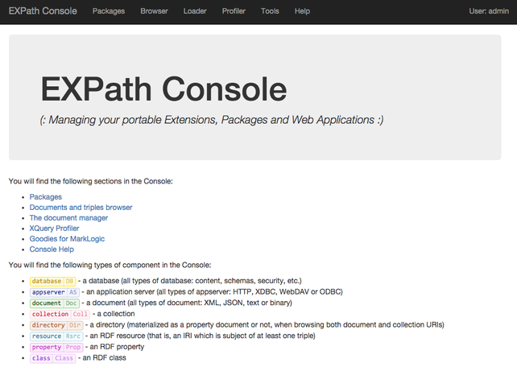
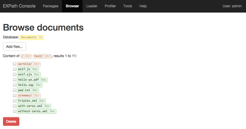
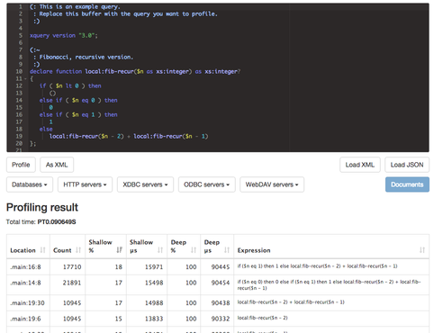

# EXPath Console for MarkLogic

The EXPath Console for MarkLogic, or just "the Console" for short,
provides the following main features:

- package manager
- browser (for documents and triples)
- document manager
- XQuery profiler

The console has been written to offer an intuitive user experience.
The pages should be intuitive and self-explaining.  If one page does
not contain enough help for you to understand what to do, please
report it to the EXPath [mailing list](http://expath.org/lists).  The
rest of this documentation is an overview of each feature, and what
you can achieve with them.



## Installation

You need to:

- Get the code.
- Create a new HTTP app server.
- Set its modules location.
- Set its URL rewriter.

You can get the code from to different sources (in both cases the root
of the sources is the directory `src/`):

- Get the latest stable version from the EXPath
  [download area](http://expath.org/files) (search for the ZIP file
  with the name "*EXPath Console for MarkLogic*").
- Clone the
  [GitHub repository](https://github.com/fgeorges/expath-ml-console)
  (the branch `master` should correspond to the latest stable release,
  when `develop` is the main development branch).

Then you can create the HTTP app server and make it point to the
source directory (or upload the sources to a modules database if you
really need to):

- Create a new HTTP server in the MarkLogic admin console.
- Put the source code of the Console at the root of the App Server
  (depending on the options you selected creating the App Server, it
  could be on its modules database or on the filesystem if you decided
  to store the modules of this App Server on the filesystem).
- Make sure to set the app server URL rewriter field (at the end of
  the admin console page for the app server) to the value
  `/plumbing/rewriter.xml`.

The document database linked to the HTTP server will not be used by
the EXPath Console for MarkLogic.  So use whetever database you want
for that field (e.g. use the default `Documents` database).

That's it!  You can now access the Console by pointing your preferred
browser to the appropriate App Server (you might need to adapt the
port number, depending on how you configured your app server):
[http://localhost:8010/](http://localhost:8010/).

## The package manager


The Console provides support for
[XAR packages](http://expath.org/spec/pkg).  A XAR package is a
collection of XML-related files, like XQuery modules, XSLT stylesheets
or XML schemas.  The console helps installing packages, deleting them,
well, managing packages on MarkLogic.  The result is that one can
manage packages on MarkLogic by using a user-friendly web UI.

Packages are installed on an app server-basis (that is, a HTTP, XDBC,
or ODBC app server).  A specific app server has to be *initialised* to
support packages (a package repository is created on its module
database or directory).  All you need to do is to click on the button
`Initialise` when displaying an app server which has not been
initialised.  Then you can install a package.

If you have a XAR file on your filesystem, you can use the "*Install
from file*" feature.  Just select the file and click `Install`.  You
can also install packages straight from [CXAN](http://cxan.org/).
CXAN is an organized, online source of packages (it is organized as a
list of persons or organisations, each providing several packages,
e.g. [fgeorges](http://cxan.org/pkg/fgeorges) provides the package
[fgeorges/fxsl](http://cxan.org/pkg/fgeorges/fxsl), among others).
The form "*Install from CXAN*" let you select which package you want
to install, and the Console downloads it and installs it
automatically.

Once a package has been installed on an app server, other modules
running in the same app server can import an XQuery modules from the
package, just by importing it using the module namespace.  Without
specifying any "at clause", decoupling dependencies between the
importing and the imported modules:

```xquery
import module namespace "http://example.org/cool/lib.xql";
```

## The browser



The browser provides you with a web UI to browse the content of a
database, in a convenient, directory-like, hierarchical way.

Regardless whether or not the directories are materialized as such on
the database, the Console present you with the hierarchical view of
the directories, and the documents they contain.  You can delete
existing documents, or even entire directories, and upload files from
your file system or create new documents from scratch.  You can
display the documents themselves (displaying their content, the
collections they are part of, some meta-data, manging their
permissions...)  You can even edit XML and XQuery files on place with
syntax highlighting!

Another way to browse the content is to browse collections.  On
MarkLogic, there is no such concept as a "collection directory", but
here also, the Console present you in a convenient directory-like
view.  The collection names are simply split using "`/`" as a
delimiter, each part being shown as a "collection directory".  For
each part that is an actual collection, all the documents in that
collection are listed.

Finally, you can also browse the triples in a database.  In that case,
you browse through the flat list of all RDF "*resources*" in the
database.  A resource is any URI which appears as the subject of at
least one triple.  Displaying the resouce itself shows you all its
properties (that is, the properties and values of all triples with the
same subject URI).

## The document manager


The document manager let you upload files from your file system to
create new documents, as well as deleting existing documents on a
database.  All forms on this page, both for insertion and deletion,
require to select a target database.

The simplest form is to select a simple file and give its entire URI.
This is complementary to the browser, which let you create a new
document under a specific "*directory*", if you prefer to copy and
past the entire URI instead of browsing directories.

You can also upload an entire directory structure (with optional
regular expressions to filter which file to upload).  Or by using a
ZIP file (which is then opened on MarkLogic, each of its content file
becoming a new document in the database).

The last way to upload content is by providing a file containing
triples (in any format supported by MarkLogic: Turtle, N3...)  The
file is parsed on the server, and the triples it contains are stored
in the triple store as "*managed triples*".  This is an easy way to
ingest triples stored in a file if you don't want to manage which
documents they are stored in.

The last forms let you delete documents and directories.  You can
achieve the same by using the browser, but here, you provide a
complete URI instead, as a text field.

## The profiler



The Console also contains a profiler.  It is very similar to the
profiler included in the MarkLogic QConsole, except on a couple of
points:

- The execution context is a bit more clear: you select either a
  database, or an app server (by type), and app servers are listed
  with some information.
- You can save and load the result of profiling, either in XML or in
  JSON.

The ability to save and load profiling reports let you save a few
executions, sometimes by changing a little bit the code, and then load
the reports themselves in MarkLogic and do some analysis on them.  It
is then possible to make some computations in XQuery or JavaScript, to
see the impact of each change, or to help investigating where the time
is spent.
