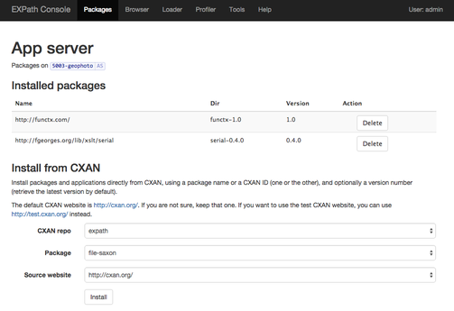

# EXPath Console for MarkLogic

Download the latest version from the EXPath [download area](http://expath.org/files).


## Installation

You need to:

- Get the code.
- Create a new HTTP app server.
- Set its modules location.
- Set its URL rewriter.

You can get the code from to different sources (in both cases the root
of the sources is the directory `src/`):

- Get the latest stable version from the EXPath
  [download area](http://expath.org/files) (search for the ZIP file
  with the name "*EXPath Console for MarkLogic*").
- Clone the
  [GitHub repository](https://github.com/fgeorges/expath-ml-console)
  (the branch `master` should correspond to the latest stable release,
  when `develop` is the main development branch).

Then you can create the HTTP app server and make it point to the
source directory (or upload the sources to a modules database if you
really need to):

- Create a new HTTP server in the MarkLogic admin console.
- Put the source code of the Console at the root of the App Server
  (depending on the options you selected creating the App Server, it
  could be on its modules database or on the filesystem if you decided
  to store the modules of this App Server on the filesystem).
- Make sure to set the app server URL rewriter field (at the end of
  the admin console page for the app server) to the value
  `/plumbing/rewriter.xml`.

The document database linked to the HTTP server will not be used by
the EXPath Console for MarkLogic.  So use whetever database you want
for that field (e.g. use the default `Documents` database).

That's it!  You can now access the Console by pointing your preferred
browser to the appropriate App Server (you might need to adapt the
port number, depending on how you configured your app server):
[http://localhost:8010/](http://localhost:8010/).

## Introduction

The EXPath Console for MarkLogic, or just "the Console" for short,
provides the following main features:

- the package manager
- the browser (for documents and triples)
- The document manager
- an XQuery profiler

The console has been written to offer an intuitive user experience.
The pages should be intuitive and self-explaining.  If one page does
not contain enough help for you to understand what to do, please
report it to the EXPath [mailing list](http://expath.org/lists).  The
rest of this documentation is an overview of each feature, and what
you can achieve with them.

## The package manager



The Console provides support for
[XAR packages](http://expath.org/spec/pkg).  A XAR package is a
collection of XML-related files, like XQuery modules, XSLT stylesheets
or XML schemas.  The console helps installing packages, deleting them,
well, managing packages on MarkLogic.  The result is that one can
manage packages on MarkLogic by using a user-friendly web UI.

Packages are installed on an app server-basis (that is, a HTTP, XDBC,
or ODBC app server).  A specific app server has to be *initialised* to
support packages (a package repository is created on its module
database or directory).  All you need to do is to click on the button
`Initialise` when displaying an app server which has not been
initialised.  Then you can install a package.

If you have a XAR file on your filesystem, you can use the "*Install
from file*" feature.  Just select the file and click `Install`.  You
can also install packages straight from [CXAN](http://cxan.org/).
CXAN is an organized, online source of packages (it is organized as a
list of persons or organisations, each providing several packages,
e.g. [fgeorges](http://cxan.org/pkg/fgeorges) provides the package
[fgeorges/fxsl](http://cxan.org/pkg/fgeorges/fxsl), among others).
The form "*Install from CXAN*" let you select which package you want
to install, and the Console downloads it and installs it
automatically.

Once a package has been installed on an app server, other modules
running in the same app server can import an XQuery modules from the
package, just by importing it using the module namespace.  Without
specifying any "at clause", decoupling dependencies between the
importing and the imported modules:

```xquery
import module namespace "http://example.org/cool/lib.xql";
```
